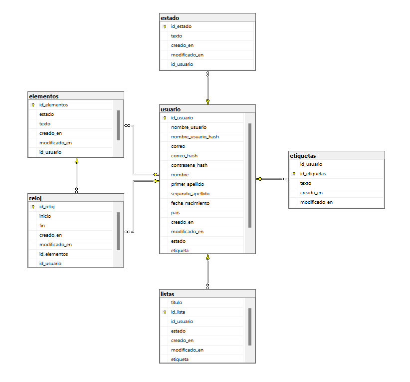

# TimeHackerBack DB
'''
create table usuario(
	id_usuario int identity not null,
	nombre_usuario varchar(50) not null,
	nombre_usuario_hash varchar(50) not null,
	correo varchar(50) not null,
	correo_hash varchar(50) not null,
	contrasena_hash varchar(50)not null,
	nombre varchar(50) not null,
	primer_apellido varchar(50) not null,
	segundo_apellido varchar(50) not null,
	fecha_nacimiento date not null,
	pais varchar(50) not null,
	creado_en datetime2 NOT NULL DEFAULT CURRENT_TIMESTAMP, 
	modificado_en datetime2 , 
	estado int not null,
	etiqueta int not null,
	id_llave int not null,

	constraint pk_usuario primary key (id_usuario)
);

create table estado(
  id_estado int identity not null,
  texto varchar(255) not null,
  creado_en datetime2 NOT NULL DEFAULT CURRENT_TIMESTAMP, 
	modificado_en datetime2 , 
  id_usuario int not null,

  constraint fk_usuario_estado foreign key (id_usuario) references usuario(id_usuario)

);

create table etiquetas(
	id_usuario int not null,
  id_etiquetas int identity not null,
  texto varchar(255) not null,
  creado_en datetime2 NOT NULL DEFAULT CURRENT_TIMESTAMP, 
	modificado_en datetime2 , 
  constraint fk_usuario_etiquetas foreign key (id_usuario) references usuario(id_usuario)

);

create table listas(
    titulo varchar(255) not null,
	id_lista int identity not null,
	id_usuario int not null,
  estado int not null,
	creado_en datetime2 NOT NULL DEFAULT CURRENT_TIMESTAMP, 
	modificado_en datetime2 , 
  etiqueta int not null,

	constraint pk_lista primary key (id_lista),
	constraint fk_usuario_lista foreign key (id_usuario) references usuario(id_usuario)
);

 alter table etiquetas
  add primary key (id_etiquetas);

  
 alter table estado
 add primary key (id_estado);

 create table elementos(
	id_elementos int not null,
  estado int not null,
  texto varchar(50) not null,
  creado_en datetime2 NOT NULL DEFAULT CURRENT_TIMESTAMP, 
	modificado_en datetime2 , 
  id_usuario int not null,

	constraint pk_elementos primary key (id_elementos),
	constraint fk_usuario_elementos foreign key (id_usuario) references usuario(id_usuario)
);
create table reloj(
  id_reloj int identity not null,
  inicio datetime,
  fin datetime2,
  creado_en datetime2 NOT NULL DEFAULT CURRENT_TIMESTAMP, 
	modificado_en datetime2 , 
  id_elementos int not null,
  id_usuario int not null,
  constraint pk_reloj primary key (id_reloj),
	constraint fk_usuario_reloj foreign key (id_usuario) references usuario(id_usuario),
	constraint fk_elemento_reloj foreign key (id_elementos) references elementos(id_elementos)

);
'''

